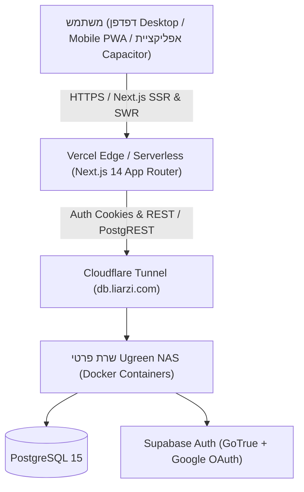

# 24H Work Dashboard — מסמך סיכום ארכיטקטורה ותכונות (App Summary & Reference)

> **תאריך עדכון:** ספטמבר 2026  
> **גרסת מערכת:** 2.0 (PostgreSQL / Supabase Self-Hosted + Next.js 14 App Router + Vercel)  
> **מטרת המסמך:** נקודת ייחוס (Baseline Reference) מקיפה עבור מפתחים, מנהלי מוצר וסוכני AI לפיתוח תכונות חדשות (Features) ושדרוגים במערכת.

---

## 1. סקירה כללית (Overview)

מערכת **24H Work Dashboard** היא אפליקציית Web & Mobile (PWA/Capacitor) מתקדמת בעברית (RTL) לניהול, דיווח, ניתוח ומעקב אחר שעות עבודה, היעדרויות (חופשה, מחלה) ושירות מילואים (בדגש על צו 8).

המערכת פותחה בהתאמה מלאה למאפייני שוק העבודה הישראלי:
- שבוע עבודה ישראלי (ברירת מחדל: ראשון–חמישי, ימי מנוחה שישי–שבת).
- תקני שעות יומיים (9.0 שעות בימים א'–ד', 8.5 שעות ביום ה').
- ניהול צבירת חופשה שנתית וחודשית ויתרות לניצול.
- ניתוח רב-שנתי של ימי מילואים (הבחנה מדויקת בין צו 8 למילואים רגילים).
- חיזוי קצב עבודה יומי נדרש להשלמת תקן החודש (Forecast).

---

## 2. ארכיטקטורה ותשתיות טכנולוגיות (Tech Stack)



### 2.1 Frontend & UI
- **Framework:** Next.js 14.2 (React 18, TypeScript).
- **Styling:** Tailwind CSS (תמיכה מלאה ב-RTL, התאמה רספונסיבית מובייל/טאבלט/דסקטופ).
- **Data Fetching & State:** `SWR` (Stale-While-Revalidate) הכולל **Optimistic Updates** — כל דיווח ועריכה מתעדכנים מיידית בממשק ונשמרים ברקע עם מנגנון שחזור שגיאות (Rollback on error).
- **גרפים וויזואליזציה:** `Recharts` (איי גרפים מוגדרים `dir="ltr"` עם יישור מימין לשמאל לתאריכים עבריים).
- **Mobile Native Wrapper:** `@capacitor/core`, `@capacitor/android`, `@capacitor/ios`.

### 2.2 Backend & Data Access
- **API Routes (Next.js App Router):** כל הפניות החיצוניות ופניות ה-Database מבוצעות בצד השרת בלבד (`server-only`).
- **אימות (Authentication):** `@supabase/ssr` המבוסס על עוגיות HttpOnly מוצפנות ו-Google OAuth. נתמך גם WebAuthn/Passkeys.
- **Middleware:** `middleware.ts` מאבטח את כל הנתיבים, מבצע רענון טוקנים אוטומטי ומגן על נתיבי API (החזרת 401 JSON במקום הפניות עיוורות).

### 2.3 מסד נתונים ותשתיות (Self-Hosted Infrastructure)
- **Database Engine:** PostgreSQL 15 (Supabase Self-Hosted רץ על שרת Ugreen NAS ביתי ב-Docker).
- **Access URL:** `https://db.liarzi.com` דרך **Cloudflare Tunnel** מוצפן ומאובטח.
- **Production URL:** `https://work-hours-dashboard-liarzi.vercel.app`

### 2.4 רמת אבטחה (OWASP Top 10 Hardened)
- **Strict Content Security Policy (CSP):** מוגדר ב-`next.config.mjs` עם Nonce / מקורות מורשים בלבד.
- **הגנת XSS, Clickjacking, MIME-sniffing:** `X-Frame-Options: DENY`, `X-Content-Type-Options: nosniff`, `Strict-Transport-Security` (HSTS).
- **הגנת Open Redirect:** ולידציה קשיחה ב-OAuth Callback (`/auth/callback`) המאשרת ניתוב אך ורק לנתיבים פנימיים (`/`).
- **הגנת CSV Injection / Formula Injection:** ניקוי אוטומטי של תווים מסוכנים (`=`, `+`, `-`, `@`) בייבוא היסטורי.
- **הגנת DoS ומגבלות גודל:** חסימת מטענים מעל 5MB וניתוח שורות מבוקר.

---

## 3. מודל הנתונים (Database Schema & Storage)

### 3.1 טבלאות PostgreSQL ב-Supabase

#### 1. טבלת `profiles`
ניהול פרופיל המשתמש והגדרות הבסיס שלו:
```sql
CREATE TABLE profiles (
  id UUID PRIMARY KEY REFERENCES auth.users(id) ON DELETE CASCADE,
  annual_vacation_quota NUMERIC DEFAULT 22.0,
  created_at TIMESTAMPTZ DEFAULT NOW(),
  updated_at TIMESTAMPTZ DEFAULT NOW()
);
```

#### 2. טבלת `workday_standards`
תקני ימי עבודה חודשיים לכל שנה (מאפשר לקבוע את כמות ימי העבודה התקניים בכל חודש 1–12):
```sql
CREATE TABLE workday_standards (
  id UUID PRIMARY KEY DEFAULT gen_random_uuid(),
  user_id UUID REFERENCES auth.users(id) ON DELETE CASCADE,
  year INTEGER NOT NULL,
  m1 NUMERIC DEFAULT 22,
  m2 NUMERIC DEFAULT 22,
  ...
  m12 NUMERIC DEFAULT 22,
  UNIQUE (user_id, year)
);
```

#### 3. טבלת `reports`
יומן הדיווחים היומי (כל שורה = יום קלנדרי):
```sql
CREATE TABLE reports (
  id UUID PRIMARY KEY DEFAULT gen_random_uuid(),
  user_id UUID REFERENCES auth.users(id) ON DELETE CASCADE,
  date DATE NOT NULL, -- YYYY-MM-DD
  entry VARCHAR(10),  -- HH:mm (למשל: "08:00")
  exit VARCHAR(10),   -- HH:mm (למשל: "17:00")
  vacation_days NUMERIC DEFAULT 0,
  sick_days NUMERIC DEFAULT 0,
  reserve_days NUMERIC DEFAULT 0,
  classification VARCHAR(50), -- "עבודה", "חופש", "מחלה", "מילואים", "חג", "סופ\"ש" וכו'
  notes TEXT,
  unique_notes TEXT,
  order_type VARCHAR(50), -- "מילואים רגילים" / "צו 8"
  created_at TIMESTAMPTZ DEFAULT NOW(),
  updated_at TIMESTAMPTZ DEFAULT NOW(),
  UNIQUE (user_id, date)
);
```

#### 4. טבלת `employment_terms`
ניהול תקופות העסקה היסטוריות ורב-שנתיות (Effective Date Ranges):
```sql
CREATE TABLE employment_terms (
  id UUID PRIMARY KEY DEFAULT gen_random_uuid(),
  user_id UUID REFERENCES auth.users(id) ON DELETE CASCADE,
  name VARCHAR(100) NOT NULL,
  employment_type VARCHAR(30) NOT NULL, -- 'monthly_overtime' | 'global' | 'hourly' | 'custom'
  start_date DATE NOT NULL,
  end_date DATE, -- NULL מסמל תקופה נוכחית/פעילה
  job_scope_pct NUMERIC DEFAULT 100,
  daily_standard_sun_wed NUMERIC DEFAULT 9.0,
  daily_standard_thu NUMERIC DEFAULT 8.5,
  overtime_eligible BOOLEAN DEFAULT true,
  notes TEXT,
  created_at TIMESTAMPTZ DEFAULT NOW()
);
```

### 3.2 נתונים מקומיים (`localStorage` ב-Client)
הגדרות תצורה והתאמה אישית נשמרות מקומית (`lib/settingsStore.ts`):
- `work-hours-classifications`: רשימת סיווגי יום דינמיים (ברירת מחדל: עבודה, חופש, מחלה, מילואים, חג, ערב חג, סופ"ש, עבודה במילואים).
- `work-hours-ordertypes`: סוגי צווי מילואים (צו 8, מילואים רגילים).
- `work-hours-holidays`: לוח חגים ישראלי (תאריך, שם חג, קטגוריה: חג / ערב חג / חול המועד).
- `work-hours-holidaynames`: שמות חגים מובנים למילוי מהיר.
- `work-hours-non-working-days`: ימי מנוחה שבועיים (ברירת מחדל: `[5, 6]` = שישי ושבת).

---

## 4. פירוט מסכים ותכונות קיימות (Features Breakdown)

```
┌────────────────────────────────────────────────────────────────────────┐
│                                HEADER                                  │
│  [Logo / Title]    [◄] יולי 2026 [►] (בחר)    [דיווח חדש]  [רענון 🔄]    │
│  Tabs:  [1. לוח בקרה]   |   [2. דיווחים]   |   [3. הגדרות תקן]         │
└────────────────────────────────────────────────────────────────────────┘
```

### 4.1 סרגל עליון (Header)
- **בורר חודש היררכי:** חיצים למעבר חודשי מהיר, או לחיצה על שם החודש לפתיחת בורר שנה (רשת שנים) ובחירת חודש בלחיצה.
- **כפתור סנכרון מהיר (Refresh):** מרענן את נתוני ה-SWR מהשרת בזמן אמת עם אנימציית סיבוב.
- **כפתור "דיווח חדש":** פותח מודאל להוספת או עריכת דיווח ליום הנבחר.
- **ניווט טאבים ראשי:** מעבר חלק בין *לוח בקרה*, *דיווחים*, ו*הגדרות*.

---

### 4.2 מסך לוח בקרה (Dashboard Screen)

1. **4 כרטיסי מדדים (KPI Cards):**
   - **שעות שדווחו:** סה"כ שעות שבוצעו החודש מול שעות היעד החודשיות (כולל אחוז התקדמות).
   - **שעות שנותרו:** כמות השעות החסרות עד ליעד החודשי, בצירוף **תחזית שעות/יום** הנדרשת להשלמה.
   - **יתרת חופשה לניצול:** יתרת ימי החופש העדכנית של העובד (מודגשת), בצירוף ימי החופש שנוצלו בחודש הנוכחי.
   - **מילואים ומחלה:** סך ימי מילואים ומחלה שנוצלו במהלך החודש הנוכחי.

2. **סיכום סטטוס חודשי (Monthly Summary Box):**
   - טבלת סיכום ברורה של שעות יעד, ביצוע בפועל ויתרה.
   - תיבת תחזית חכמה המציגה: כמה ימי עבודה נותרו בחודש (בהתחשב בימי מנוחה ושעת סגירת יום 17:00), ומהו קצב השעות היומי הנדרש לעמידה בתקן.

3. **גרף פעילות שעות יומית (Daily Hours Chart):**
   - גרף עמודות אינטראקטיבי של ימי החודש (1 עד 28–31), מוצג ב-RTL (יום 1 בימין).
   - קו תקן יומי (9 שעות בימים רגילים, 8.5 שעות בימי חמישי).
   - צבעי עמודות המבחינים בין יום עבודה רגיל, שעות נוספות, סופ"ש והיעדרויות.

4. **גרף מילואים רב-שנתי עם Drill-Down (Reserve Duty Chart):**
   - גרף עמודות מצטבר של ימי מילואים לאורך השנים.
   - הפרדה צבעונית בין **צו 8** (אדום/כתום) לבין **מילואים רגילים** (כחול).
   - **Drill-down אינטראקטיבי:** לחיצה על שנה מסוימת בגרף מעבירה מיידית לתצוגת חודשים (ינואר–דצמבר) של אותה שנה, עם כפתור חזרה נוח לתצוגה רב-שנתית.

5. **באנר סטטוס וטוסט התראה:**
   - באנר ירוק בראש הלוח המציג חיבור פעיל למסד הנתונים, כמות רשומות כוללת וטווח תאריכים היסטורי.
   - טוסט צף בצד המסך המתריע כאשר חסרות שעות ביחס לקצב החודשי הצפוי.

---

### 4.3 מסך דיווחים ויומן היסטורי (Reports Screen)

1. **סינון וחיפוש מתקדם:**
   - סינון לפי שנה וחודש.
   - סינון מהיר לפי סיווג (עבודה, חופש, מחלה, מילואים וכו').
   - שורת חיפוש חופשי (חיפוש תאריך, יום, הערות, סיווג).

2. **טבלת יומן מפורטת:**
   - תאריך ויום בשבוע בעברית.
   - שעות כניסה ויציאה (24H).
   - סה"כ שעות יומיות ותרגום עשרוני.
   - צ'יפ סיווג צבעוני (לדוגמה: ירוק לעבודה, כחול למילואים, אדום למחלה, כתום לחופש).
   - פירוט היעדרויות (ימי חופש, מחלה, מילואים).
   - הערות כלליות והערות ייחודיות.
   - כפתור עריכה מהיר לכל שורה.

3. **מנגנון עדכון מרוכז (Bulk Update):**
   - בחירת שורות מרובות באמצעות תיבות סימון (Checkboxes) או בחירת כל השורות המוצגות.
   - סרגל פעולות צף עם כפתור "עדכון מרוכז של X שורות".
   - **מודאל עדכון מרוכז עם בחירת שדות סלקטיבית:** המשתמש מסמן רק את השדות שהוא רוצה לשנות (למשל: רק סיווג, או רק שעות, או רק הערה) מבלי לדרוס שדות קיימים אחרים.
   - **תצוגת Diff מקדימה (לפני/אחרי):** מציגה בבירור כיצד כל שורה תשתנה לפני ביצוע השמירה במסד הנתונים.

---

### 4.4 מסך הגדרות תקן ומערכת (Settings Screen)

1. **תנאי העסקה והיסטוריית חוזים (Employment Terms & History):**
   - ניהול תקופות העסקה שונות לאורך הזמן (Effective Date Ranges).
   - תמיכה בתבניות מוכנות מראש: חודשי עם שעות נוספות, שכר גלובלי, שעתי, משרת הורה/מקוצרת (8 שעות), חצי משרה (50%).
   - הגדרה מותאמת אישית של היקף משרה (%), שעות תקן יומיות א'–ד' ויום ה', וזכאות לשעות נוספות.
   - מודאל הוספה ועריכה נוח עם עדכון אופטימיסטי מיידי.

2. **מכסת חופשה שנתית:**
   - קביעת מכסת ימי חופשה שנתית (נשמרת בטבלת `profiles` ב-Postgres).
   - חישוב אוטומטי של קצב הצבירה החודשי (למשל: 22 ימים = 1.83 ימים לחודש).

3. **מטריצת תקן ימי עבודה חודשיים:**
   - הגדרת מספר ימי העבודה התקניים לכל חודש בשנה (1–12).
   - תמיכה בהוספת שנים חדשות ושמירה מרוכזת בטבלת `workday_standards`.

3. **הגדרת ימי מנוחה שבועיים (Non-Working Days):**
   - כפתורי סימון מותאמים לכל ימי השבוע (ראשון עד שבת).
   - משפיע באופן ישיר על חישוב ימי העבודה הנותרים בחודש והתחזית בלוח הבקרה.

4. **ניהול רשימות בחירה מותאמות (Dropdown Options):**
   - הוספה ומחיקה של סיווגי יום מותאמים אישית.
   - הוספה ומחיקה של סוגי צווי מילואים.
   - הוספה ומחיקה של שמות חגים.

5. **ניהול וסנכרון לוח חגים ישראלי (Hebcal Integration):**
   - **אינטגרציה אוטומטית עם Hebcal API:** סנכרון בלחיצת כפתור של ערבי חג, חגים וימי חול המועד בישראל (`i=on`, `lg=he`) ישירות ללוח השנה.
   - **סנכרון רב-שנתי:** תמיכה בסנכרון שנה ספציפית או סנכרון רב-שנתי מלא (טווח של 5 שנים) בלחיצה אחת.
   - **זיהוי והשלמה אוטומטית בדיווח:** בעת פתיחת דיווח ליום חג, המערכת מזהה אוטומטית את המועד, מציגה תגית זיהוי, ומשלימה אוטומטית סיווג ("חג" / "ערב חג") והערת שם החג.
   - טבלת חגים עם חלוקה לקטגוריות (חג, ערב חג, חול המועד), אפשרות לעריכה ומחיקה, ייבוא/ייצוא CSV ותבנית מובנית.

6. **ייבוא נתונים היסטוריים מקובץ CSV:**
   - העלאת קובץ CSV עם היסטוריית דיווחים.
   - בדיקת תקינות, מניעת הזרקות (Anti-Formula-Injection), שיוך אוטומטי למשתמש המחובר וטעינת אלפי רשומות בו-זמנית ישירות ל-Postgres.

---

## 5. מנוע החישובים והלוגיקה העסקית (`lib/calc.ts`, `lib/derive.ts`)

| מדד / ערך | נוסחה ואופן החישוב |
| :--- | :--- |
| **תרגום שעות לעשרוני** | `(שעת יציאה בדקות − שעת כניסה בדקות) ÷ 60`. לדוגמה: `08:00–16:30` = `8.5` שעות. |
| **תקן יומי** | ראשון–רביעי = `9.0`, חמישי = `8.5`, שישי/שבת/חג/סופ"ש = `0.0`. |
| **שעות נוספות יומיות** | `max(סה"כ שעות − תקן יומי, 0)`. |
| **יעד שעות חודשי** | `ימי תקן לחודש (מההגדרות) × 9.0`. |
| **שעות שנותרו להשלמה** | `max(יעד חודשי − שעות שדווחו בפועל, 0)`. |
| **ימי עבודה שנותרו בחודש** | ימים שטרם חלפו, שאינם מוגדרים כימי מנוחה, שטרם הושלם בהם דיווח, ובהנחה שטרם חלפה השעה 17:00 ביום הנוכחי. |
| **תחזית קצב יומי (Forecast)** | `שעות שנותרו ÷ ימי עבודה שנותרו`. |
| **יתרת חופשה מצטברת** | `מכסה שנתית ÷ 12 × חודשים שעברו מתחילת הנתונים − סך ימי חופשה שנוצלו מראשית הנתונים`. |
| **סיווג מילואים צו 8** | בדיקה אם סוג הצו הוא "צו 8" או שההערה מכילה את הביטוי `צו 8` (באמצעות Regex: `/צו\s*8/`). |

---

## 6. תוכנית ורעיונות להרחבות עתידיות (Feature Roadmap Reference)

מסמך זה מהווה תשתית להוספת תכונות עתידיות. להלן רשימת תכונות מומלצות לפי עדיפות:

### 6.1 דוחות וייצוא (Reporting & Exporting)
- **ייצוא ל-PDF / טופס נוכחות חודשי:** הפקת קובץ PDF מעוצב ומוכן לחתימה של העובד והמעסיק בסוף כל חודש.
- **ייצוא לאקסל/CSV להנהלת חשבונות:** הפקת קובץ שכר חודשי המפרט שעות רגילות, שעות נוספות (125%, 150%), ימי מחלה וימי חופש.

### 6.2 מודול שכר וחישובי שעות נוספות מתקדמים
- **חישוב שעות נוספות מדורג לפי חוק שעות עבודה ומנוחה:**
  - 2 השעות הנוספות הראשונות ביום: תעריף 125%.
  - כל שעה נוספת מעבר לכך: תעריף 150%.
  - עבודה בימי מנוחה / שבת: תעריף 150% / 175%.

### 6.3 אינטגרציות אוטומטיות
- **סנכרון אוטומטי של חגי ישראל (Hebcal API):** טעינה אוטומטית של ערבי חג, חגים וימי שבתון ישירות מ-API ללא צורך בהזנה ידנית של לוח החגים בהגדרות.
- **סנכרון ל-Google Calendar / Outlook:** אפשרות לייבא אירועים ופגישות או לנעול ימי חופשה ומילואים ביומן.

### 6.4 יכולות מובייל ושעון נוכחות מהיר (PWA / Capacitor)
- **כפתור "החתמת שעון" מהיר (Clock In / Clock Out):** כפתור ראשי בדף הבית המאפשר בלחיצה אחת לקבוע שעת כניסה ויציאה של היום בזמן אמת.
- **תזכורות פוש (Push Notifications):** תזכורת בסוף יום העבודה למשתמש לדווח שעות אם טרם הזין שעת יציאה.
- **זיהוי מיקום גיאוגרפי (Geo-fencing אופציונלי):** זיהוי הגעה למשרד או למקום העבודה והצגת הודעת החתמה.

### 6.5 שדרוגי ארכיטקטורה ו-Multi-User
- **העברת הגדרות ה-Client (רשימות סיווגים, חגים) ל-Database:** כיום חלק מהרשימות שמורות ב-`localStorage`. שמירתן בטבלה ייעודית ב-Postgres תאפשר סנכרון מלא בין מכשירים שונים (טלפון, מחשב עבודה, מחשב ביתי).
- **תמיכה בריבוי משתמשים / צוותים:** אפשרות למנהל לצפות בדיווחי עובדים, לאשר ימי חופשה ולנהל צוות.
